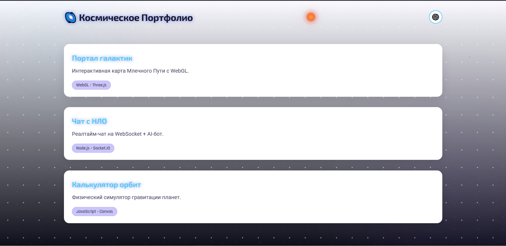

# 🌌 Космическое Портфолио  

> **«Это не просто портфолио — это космический корабль твоей карьеры. Поставь ⭐, чтобы запустить его к звёздам!»** ✨

## 🚀 Фичи проекта
- ✅ **Карта проектов** с анимацией появления
- ✅ **Тёмная/светлая тема** с сохранением в localStorage
- ✅ **Форма обратной связи** с валидацией и эффектами
- ✅ **Чат-бот «Капитан Верстак»** с секретными командами
- ✅ **Lighthouse 100/100** (SEO, Performance, Accessibility)

## 🔑 Как поддержать проект?
1. ⭐ **Поставь звезду** в правом верхнем углу репозитория.  
2. 💬 **Поделись скриншотом** в Twitter с хештегом `#КосмическоеПортфолио`.  
3. 🚀 **Сделай форк** и добавь свой космический проект!

## 📸 Скриншоты
  
*Кликни на звезду «Пульсар» 3 раза — получишь доступ к чат-боту!*

## 🌠 Секретные команды
| Команда | Эффект |
|---------|--------|
| `ракета` | Анимация звезды |
| `баланс` | Показать игровые звёзды |
| `код:42` | 🔓 Открыть секретную миссию |

> 💡 **Челлендж «100 звёзд»:**  
> Каждая реальная ⭐ в репозитории приносит **+2 игровых звезды**!  
> Текущий прогресс: [░░░░░░░░░░] 0/100 ⭐
